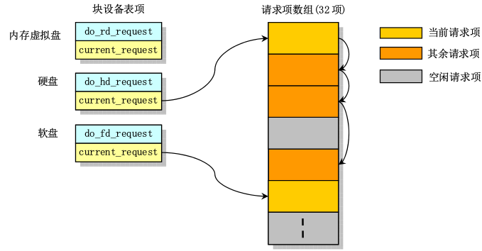

# 块设备驱动

## 块设备读写
### 读写接口函数
块设备的读写接口是`ll_rw_block()`
* __输入参数：__  
>rw 表示读写命令 READ 或 WRITE  
    `#define READ 0`  
    `#define WRITE 1`  
    `#define READA 2`  	
    `#define WRITEA 3`  
>bh 高速缓冲块指针  

* __函数体：__

      void ll_rw_block(int rw, struct buffer_head * bh)
      {
          unsigned int major;

          if ((major=MAJOR(bh->b_dev)) >= NR_BLK_DEV ||
          !(blk_dev[major].request_fn)) { // request_fn即do_XX_request函数指针
              printk("Trying to read nonexistent block-device\n\r");
              return;
          }
          make_request(major,rw,bh);
      }
当内核需要读写块设f备时传入适当参数调用ll_rw_block()即可。如bread中的调用：`ll_rw_block(READ,bh);`。在ll_rw_block中即调用make_request来根据参数把读写请求封装成request结构。
### 读写请求的封装
* __请求结构体__  
linux-0.11用`struct request`来封装一个块设备读写请求,并用一个全局数组来存放所有的request:  

    // blk.h
    struct request {
        int dev;		/*设备号 -1 if no request */
        int cmd;		/* READ or WRITE */
        int errors;
        unsigned long sector;
        unsigned long nr_sectors;
        char * buffer;
        struct task_struct * waiting;
        struct buffer_head * bh;
        struct request * next; // 用来形成请求链表
    };
    // ll_rw_block.c  NR_REQUEST=32 
    // 全局的request数组来存放request:
    struct request request[NR_REQUEST];
* __封装函数__  

      static void make_request(int major,int rw, struct buffer_head * bh)
      {
          struct request * req;
          int rw_ahead;
          // ......参数及锁检查......      
      repeat:
          if (rw == READ)
              req = request+NR_REQUEST;
          else
              req = request+((NR_REQUEST*2)/3);
          /* *###获得空闲request */
          while (--req >= request)
              if (req->dev<0)
                  break;      
          if (req < request) {
              // 获取失败则睡眠等待,唤醒后重新找
              goto repeat;
          }
          /* f填充request并将其加入链表 */
          req->dev = bh->b_dev;
          req->cmd = rw;
          req->errors=0;
          req->sector = bh->b_blocknr<<1;
          req->nr_sectors = 2;
          req->buffer = bh->b_data;
          req->waiting = NULL;
          req->bh = bh;
          req->next = NULL;
          add_request(major+blk_dev,req);
      }
      
该函数从全局request数组中取得一个空闲的项,然后根据参数填充request结构，再将其加入请求链表。
  

### 块设备的请求队列与电梯算法
* __基本结构__  
linux-0.11用主设备号为索引的块设备表来索引每一种设备的请求操作函数`request_fn`和当前正在处理的请求`current_request`:  

      // ll_rw_block.c  32, NR_BLK_DEV=7
      struct blk_dev_struct blk_dev[NR_BLK_DEV]
      // blk.h 45. 块设备结构体: 
      struct blk_dev_struct {
          void (*request_fn)(void);
          struct request * current_request;
      };  
request_fn的复制分别在`hd_init()`、`floppy_init()`和`rd_init()`中。
`current_request`指针和request中的`next`共同为一种块设备构成了请求链表，current_request指向该链表的头。  
设备表和请求队列的关系如下图：

* __队列的增长__  
新增请求时由make_request函数调用add_request来将封装好的request加入到指定块设备的请求队列(链表)中，下面是add_request()的实现：  

      static void add_request(struct blk_dev_struct * dev, struct request * req)
      {
          struct request * tmp;

          req->next = NULL;
          cli();
          if (req->bh)
              req->bh->b_dirt = 0;
          if (!(tmp = dev->current_request)) {
              dev->current_request = req;
              sti();
              (dev->request_fn)();
              return;
          }
          for ( ; tmp->next ; tmp=tmp->next)
              if ((IN_ORDER(tmp,req) || 
                  !IN_ORDER(tmp,tmp->next)) &&
                  IN_ORDER(req,tmp->next))
                  break;
          req->next=tmp->next;
          tmp->next=req;
          sti();
      }
* __电梯算法__

### 请求的处理过程
从add_request可以看出当设备的current_request为空（即设备空闲），则立即调用`dev->request_fn`进行请求的处理。
内核操作(读写)块设备通过中断来实现，内核向硬盘的控制器发出读/写或其他操作指令，然后返回；硬盘控制器收到指令后指挥硬盘驱动器执行读写等操作，操作完成后就会向CPU发送中断请求，中断处理程序判断是否还有要读写的数据，若有则继续发送操作指令，如此反复。若读写完成，中断处理程序就会执行请求结束的操作，唤醒等待该IO请求的进程。

