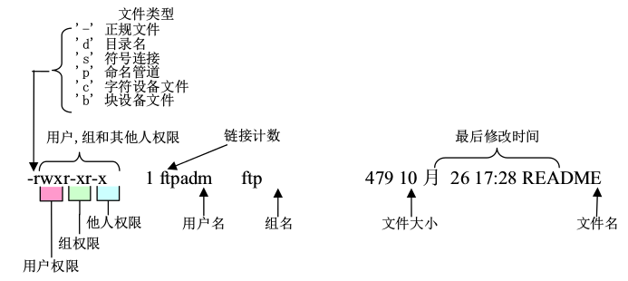
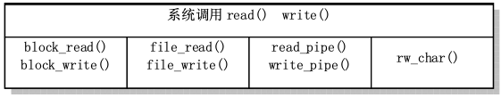
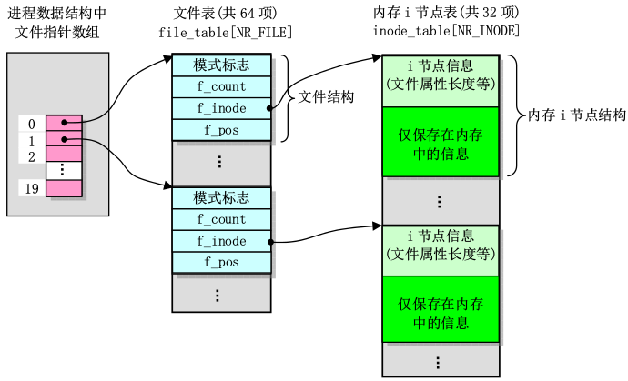

# *linux0.11文件系统
### *文件系统结构介绍
linux0.11使用的是MINIX文件系统1.0版本,她将磁盘划分成1KB大小的磁盘块，它的结构如下图（每个方格代表一个磁盘块）：

  
* **引导块**：存放引导信息的块,如果该设备不是引导设备则引导块是空的
* **超级块**：存放文件系统结构信息，包括i节点位图和逻辑块位图分别占逻辑块数，数据区开始逻辑块号，最大文件长度，文件系统魔数等。linux0.11加载的超级快放在数组`super_block[]`中  
* **逻辑块位图**：用于记录每个逻辑块是否使用（0表示空闲），它的最低位始终为1;
* **i节点位图**：记录i节点是否使用,同理，它的最低位始终为1;
* **i节点**：32字节，记录着文件信息（文件属性，所在数据块等），每个文件和目录都对应了一个i节点；i_zone[9]数组记录文件所在的盘块号码，0~6是直接块号，7是一次间接块号，8是二次间接块号;一个盘块可放512个盘块号；注意i节点中没有文件名，文件名放在目录项中。  

_**注意：**_盘块(磁盘块)和逻辑块不是一个概念，一个逻辑块可以是1,2,4,8个盘块，对于linux0.11,该数为1,所以逻辑块和盘块号一样。
#### 文件类型
inode中的i_mode字段表示文件的类型，权限等属性：  

#### 目录结构
对一个目录来说，它没有实际的数据，所以它的数据块中存放的是它里面的所有文件名对应的目录项。目录项结构如下:  

    // include/linux/fs.h
    #define NAME_LEN 14
    struct dir_entry {
        unsigned short inode; // i节点号
        char name[NAME_LEN];
    };
若要根据文件名来得到i节点，就得通过目录项来查找。
### *高速缓冲区管理
高速缓冲区是文件系统访问块设备中数据的必经要道。内核将高速缓冲区划分成与磁盘块大小相等的__缓冲块__来管理。高速缓冲中存放着最近被使用过的各个块设备中的数据块，当从块设备读取数据时先找找高速缓冲中有没有，若没有，再从块设备读取到高速缓冲中。当要向块设备写数据时，先在高速缓冲中申请一块空闲缓冲块来临时存放数据，至于什么时候写到设备中，是通过__设备数据同步__实现的。  
文件系统中其他程序通过指定__设备号__和数据__逻辑块号__来调用它的读写函数:
* bread()
* breada()
* bread_page()
* getblk()
### *文件系统底层函数
* **bitmap.c** i节点位图和逻辑块位图操作函数 
    * free_inode()
    * new_inode()
    * free_block()
    * new_block()
* **truncate.c** 文件截取为0  
    * truncate()
* **inode.c** i节点操作函数  
    * iget()
    * iput()
    * bmap()
    * sync_inodes()
* **namei.c** 根据文件名找i节点 
    * namei()
* **super.c** 超级块处理  
定义全局变量超级块数组和根设备号：
      // NR_SUPER=8 见fs.h
      struct super_block super_block[NR_SUPER];
      /* this is initialized in init/main.c */
      int ROOT_DEV = 0;
    * `get_super()`   
    在超级块数组中查找指定设备的超级块结构，找到则返回指针否则返回NULL
    * `put_super()`  
    释放指定设备的超级块:释放设备使用的超级块数组项，并释放该设备i节点位图和逻辑块位图所占用的高速缓冲块,最后调用free_super()。
    * `read_super()` 
    从设备中读取超级块到缓冲块中，再复制到超级块数组.同时读取i节点位图和逻辑块位图。
    * `sys_umount()`
    卸载指定设备名的设备
    * `free_super()`
    * `sys_mount()` 
    * `mount_root()` 

 
 
 ### *文件数据的访问
 主要涉及`block_dev.c、file_dev.c、char_dev.c、pipe_dev.c`和`read_write.c`。read_write.c中包含read()和write()系统调用，它们通过对所操作文件属性的判断来调用这些文件中相关的函数。
 
 

### *文件高层操作

 open.c主要用于文件的打开创建关闭，属性修改等  
 exec.c主要用于do_execve()  
 fcntl.c主要实现了fcntl()和dup(),dup2()  
 ioctl.c主要实现了ioctl().主要调用tty_ioctl()
 stat.c实现文件属性的获取stat()和fstat()  
 
 ### *挂载机制
 超级块中的`struct m_inode * s_imount`是该文件系统被挂载到的i节点指针,i节点的`unsigned char i_mount`是挂载标志(非0说明这是一个挂载点)。  
 在iget获取i节点时，如果得到的i节点i_mount标志非0,则需要寻找挂载在这个i节点上的实际文件系统的根i节点。  
 
       // inode.c 263
       if (inode->i_mount) {
			int i;
            // 遍历超级块表看看哪个文件系统挂载在这个i节点上
			for (i = 0 ; i<NR_SUPER ; i++)
				if (super_block[i].s_imount==inode)
					break;
			if (i >= NR_SUPER) {
				printk("Mounted inode hasn't got sb\n");
				if (empty)
					iput(empty);
				return inode;
			}
			iput(inode); 
			dev = super_block[i].s_dev; // 设备号为实际挂载设备
			nr = ROOT_INO; // 设i节点号为1
			inode = inode_table; // 从i节点表开始处继续找
			continue;
		}