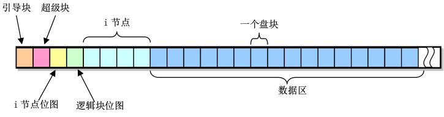

# *linux0.11文件系统
linux0.11使用的是MINIX文件系统1.0版本,她将磁盘划分成1KB大小的磁盘块，它的结构如下图（每个方格代表一个磁盘块）：

  
* **引导块**：存放引导信息的块,如果该设备不是引导设备则引导块是空的
* **超级块**：存放文件系统结构信息，包括i节点位图和逻辑块位图分别占逻辑块数，数据区开始逻辑块号，最大文件长度，文件系统魔数等。linux0.11加载的超级快放在数组`super_block[]`中  
* **逻辑块位图**：用于记录每个逻辑块是否使用（0表示空闲），它的最低位始终为1;
* **i节点位图**：记录i节点是否使用,同理，它的最低位始终为1;
* **i节点**：32字节，记录着文件信息（文件属性，所在数据块等），每个文件和目录都对应了一个i节点；i_zone[9]数组记录文件所在的数据块，0~6是直接块号，7是一次间接块号，8是二次间接块号;一个盘块可放512个盘块号；
* 