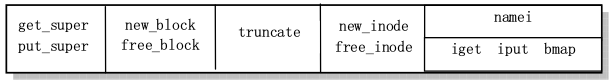

# *linux0.11文件系统
linux0.11使用的是MINIX文件系统1.0版本,她将磁盘划分成1KB大小的磁盘块，它的结构如下图（每个方格代表一个磁盘块）：

  
* **引导块**：存放引导信息的块,如果该设备不是引导设备则引导块是空的
* **超级块**：存放文件系统结构信息，包括i节点位图和逻辑块位图分别占逻辑块数，数据区开始逻辑块号，最大文件长度，文件系统魔数等。linux0.11加载的超级快放在数组`super_block[]`中  
* **逻辑块位图**：用于记录每个逻辑块是否使用（0表示空闲），它的最低位始终为1;
* **i节点位图**：记录i节点是否使用,同理，它的最低位始终为1;
* **i节点**：32字节，记录着文件信息（文件属性，所在数据块等），每个文件和目录都对应了一个i节点；i_zone[9]数组记录文件所在的盘块号码，0~6是直接块号，7是一次间接块号，8是二次间接块号;一个盘块可放512个盘块号；注意i节点中没有文件名，文件名放在目录项中。  

_**注意：**_盘块(磁盘块)和逻辑块不是一个概念，一个逻辑块可以是1,2,4,8个盘块，对于linux0.11,该数为1,所以逻辑块和盘块号一样。
### 文件类型
inode中的i_mode字段表示文件的类型，权限等属性：  

### 目录结构
对一个目录来说，它没有实际的数据，所以它的数据块中存放的是它里面的所有文件名对应的目录项。目录项结构如下:  

    // include/linux/fs.h
    #define NAME_LEN 14
    struct dir_entry {
        unsigned short inode; // i节点号
        char name[NAME_LEN];
    };
若要根据文件名来得到i节点，就得通过目录项来查找。
### 高速缓冲区
高速缓冲区是文件系统访问块设备中数据的必经要道。内核将高速缓冲区划分成与磁盘块大小相等的__缓冲块__来管理。高速缓冲中存放着最近被使用过的各个块设备中的数据块，当从块设备读取数据时先找找高速缓冲中有没有，若没有，再从块设备读取到高速缓冲中。当要向块设备写数据时，先在高速缓冲中申请一块空闲缓冲块来临时存放数据，至于什么时候写到设备中，是通过__设备数据同步__实现的。  
文件系统中其他程序通过指定__设备号__和数据__逻辑块号__来调用它的读写函数:
* bread()
* breada()
* bread_page()
### 文件系统底层函数
* i节点位图和逻辑块位图操作函数 bitmap.c
    * free_inode()
    * new_inode()
    * free_block()
    * new_block()
* 文件截取为0  truncate.c
    * truncate()
* i节点操作函数  inode.c
    * iget()
    * iput()
    * bmap()
* 根据文件名找i节点
    * namei()
* 超级块处理
    * get_super()
    * put_super()
    * free_super()
    * sys_mount()  

 
 
 ### 文件数据的访问
 主要涉及`block_dev.c、file_dev.c、char_dev.c、pipe_dev.c`和`read_write.c`。read_write.c中包含read()和write()系统调用，它们通过对所操作的文件的属性的判断来调用这些文件中相关的函数。